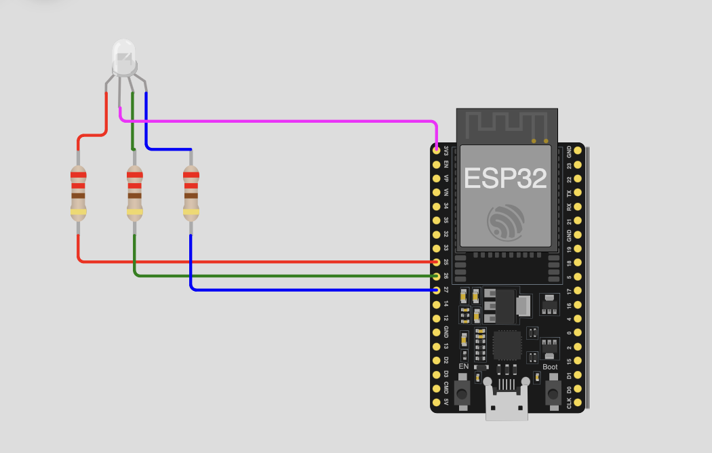

# Projeto 4 - Controle PWM e Comunicação com ESP32

## Disciplina: SEL0614 - Aplicação de Microprocessadores

## Membros do Grupo
- Leonardo Gueno Rissetto (13676482)
- Thiago Kashivagui Gonçalves (13676579)
- Lucas Lima Romero (13676325)
- Marco Antonio Gaspar Garcia (11833581)

###  Programa 1 - Controle de Servo Motor e Comunicação Serial com ESP32

## 1. Resumo
Este projeto implementa um controle PWM para um servo motor, utilizando a plataforma ESP32. O sistema inclui a leitura de botões para alternar entre modos automáticos e manuais de controle de posição do servo, além de um display OLED que exibe a posição e o sentido de rotação do motor. A comunicação serial via UART e o uso de um potenciômetro permitem o controle do ângulo do servo manualmente, enquanto os botões alteram o comportamento do sistema. O projeto foi desenvolvido e testado utilizando o simulador **Wokwi**, uma plataforma online de prototipagem de circuitos.

## 2. Objetivos
O principal objetivo deste projeto é implementar um controle de posição para um servo motor utilizando PWM, com duas formas de controle: automática e manual. Através de botões, o sistema pode alternar entre modos e o uso de um potenciômetro permite ajustar o ângulo do servo. O display OLED exibe informações sobre o estado do sistema, incluindo o ângulo do servo e o sentido de rotação. O controle do sistema é feito pela plataforma ESP32 com o ambiente de desenvolvimento **Arduino IDE**.

### Objetivos específicos:
- Implementar o controle PWM para o servo motor.
- Usar botões para alternar entre os modos automático e manual.
- Utilizar um potenciômetro para ajustar o ângulo do servo no modo manual.
- Exibir informações sobre o ângulo e o sentido da rotação no display OLED.
- Comunicação serial via UART para exibir dados no terminal.

## 3. Materiais e Métodos

### Materiais:
- **Microcontrolador**: ESP32 Devkit.
- **Simulador**: Wokwi (plataforma online de prototipagem de circuitos).
- **Linguagem de programação**: C/C++ com Arduino IDE.
- **Componentes adicionais**:
  - Servo motor.
  - Display OLED (conexão I2C).
  - Botões (3).
  - Potenciômetro.

### Métodos:
O projeto foi desenvolvido utilizando o framework **Arduino IDE** e o simulador **Wokwi**. O controle PWM do servo motor foi implementado com a biblioteca "ESP32Servo", e a comunicação com o display OLED foi feita com as bibliotecas "Wire" e "Adafruit_SSD1306". O código foi estruturado para ler os botões e alternar entre os modos de controle, além de ajustar o ângulo do servo de acordo com a leitura do potenciômetro. O código também envia dados para o terminal serial via UART.

## 4. Descrição
### Inicialização:
- O pino GPIO utilizado para o controle PWM do servo foi configurado.
- O display OLED foi inicializado para comunicação I2C.
- Três botões foram configurados para as funções de iniciar o modo automático, iniciar o modo manual e desligar o sistema.
- O potenciômetro foi conectado a um pino analógico para leitura de valores de tensão.

### Funcionamento:
1. **Modo Automático**: No modo automático, o servo motor se move de 0° a 180° e depois retorna de 180° a 0°, com intervalos de tempo específicos para cada direção. Esse movimento é repetido continuamente até que o botão de desligar seja pressionado.
2. **Modo Manual**: No modo manual, o usuário controla o ângulo do servo motor ajustando o potenciômetro, o que altera o duty cycle do PWM para controlar a posição do servo.
3. **Exibição no Display OLED**: O ângulo do servo e o sentido de rotação são exibidos no display OLED. As informações também são enviadas para o terminal via comunicação UART.

### Controle PWM:
- A frequência do PWM foi configurada para 50 Hz, como requerido para controle de servo motores.
- O valor do duty cycle foi ajustado de acordo com o ângulo desejado, variando de 0° a 180°.
  
### Alteração entre Modos:
- O primeiro botão alterna o sistema para o modo automático.
- O segundo botão alterna para o modo manual, onde o ângulo do servo é controlado pelo potenciômetro.
- O terceiro botão desliga o sistema e impede que o servo motor se mova.

## 5. Resultados e Discussão
O projeto foi implementado com sucesso no simulador Wokwi. Os resultados atendem aos seguintes requisitos:

- **Controle de Posição do Servo**: O servo motor foi controlado adequadamente nos modos automático e manual. No modo automático, o servo se movia de 0° a 180° e vice-versa. No modo manual, a posição foi ajustada pelo potenciômetro.
- **Exibição no Display OLED**: As informações sobre o ângulo do servo e o sentido de rotação foram exibidas corretamente no display OLED.
- **Comunicação Serial**: Os dados sobre o ângulo do servo e o modo de operação foram transmitidos via UART para o terminal serial.
- **Interatividade**: O uso de botões para alternar entre modos e o controle manual pelo potenciômetro permitiram uma interação direta com o sistema.

### Exemplos do Funcionamento:
1. Exibição do ângulo do servo no modo automático:

   

2. Exibição da alteração do ângulo no modo manual com o potenciômetro:

   

3. Exibição da interrupção do modo automático:

    

### Discussão:
O uso de PWM para controle do servo motor foi eficaz e atendeu aos requisitos de precisão de controle de posição. A alternância entre os modos automático e manual funcionou conforme esperado. A implementação do display OLED e a comunicação via UART facilitaram o monitoramento do sistema. O uso de botões e potenciômetro forneceu uma interface simples e intuitiva para o usuário.

## 6. Como executar o código

### Instalação do Ambiente:
1. Baixe e instale o **Arduino IDE**.
2. Adicione o suporte à ESP32 no Arduino IDE, acessando **Arquivo > Preferências** e inserindo o seguinte URL no campo "URLs adicionais para gerenciadores de placas": `https://dl.espressif.com/dl/package_esp32_index.json`
3. Selecione a placa ESP32 no menu **Ferramentas > Placa**.

### Executando o Código:
1. No Arduino IDE, abra o arquivo `.ino` do projeto e selecione a placa ESP32 e a porta COM correta.
2. Compile e carregue o código na placa ESP32.
3. Conecte o servo motor, display OLED, botões e potenciômetro conforme o esquema do projeto.
4. Abra o monitor serial no Arduino IDE para visualizar os dados enviados via UART.

### Simulação no Wokwi:
1. Acesse a plataforma **Wokwi** e crie um novo projeto para a ESP32.
2. Conecte os componentes (servo motor, display OLED, botões e potenciômetro) conforme o esquema de ligação.
3. Carregue o código diretamente na plataforma Wokwi.
4. Execute a simulação e observe o comportamento do sistema, como a movimentação do servo, as mudanças de modo e a exibição das informações no display OLED.

## 7. Conclusão
Este projeto permitiu a implementação de um controle PWM para um servo motor com a plataforma ESP32. O controle foi feito em dois modos: automático e manual, com exibição do estado do sistema em um display OLED e via comunicação serial. A interação com o sistema foi facilitada pelos botões e pelo potenciômetro, proporcionando uma interface simples e eficiente. O sucesso do projeto demonstrou a versatilidade da ESP32 para controle de periféricos e comunicação serial, e o uso do simulador Wokwi proporcionou uma plataforma prática para prototipagem e teste do circuito.

## Programa 2 - Controle de LED RGB com ESP32 utilizando PWM

### 1. Resumo
Neste projeto, foi utilizado o **ESP32 Devkit** para controlar um **LED RGB** (cátodo comum) com modulação de largura de pulso (PWM). O código foi desenvolvido utilizando o **ESP-IDF**, o framework nativo da Espressif, sem o uso da **Arduino IDE**. A modulação de cores foi realizada por meio da técnica de PWM, controlando individualmente os pinos responsáveis pelas cores **Vermelho (R)**, **Verde (G)** e **Azul (B)**, com um controle de brilho utilizando uma resolução de 8 bits.

### 2. Objetivos
O principal objetivo deste projeto foi implementar um controle de cor de um LED RGB utilizando a técnica PWM no ESP32, permitindo ajustar o brilho de cada cor do LED (R, G e B). O controle de brilho foi feito variando o duty cycle de cada pino com a resolução de 8 bits, permitindo uma modulação precisa das cores. A comunicação via UART foi utilizada para exibir no monitor serial o valor do incremento e do duty cycle de cada cor.

### Objetivos específicos:
- Controlar o brilho do LED RGB utilizando PWM em 3 pinos GPIO do ESP32.
- Utilizar a biblioteca **LEDC** (LED Control PWM) do ESP32 para implementar o controle de brilho.
- Modificar o duty cycle de cada cor individualmente, com incremento de 5 unidades por vez, variando de 0 a 100% de brilho.
- Exibir no Monitor Serial o valor de incremento e duty cycle para cada cor.
- Explorar a comunicação sem fio via Bluetooth (opcional).

## 3. Materiais e Métodos

### Materiais:
- **Microcontrolador**: ESP32 Devkit.
- **Linguagem de programação**: C/C++ com **ESP-IDF**.
- **Componentes adicionais**:
  - LED RGB (cátodo comum).
  - Resistores de 220 ohms.
  - Jumpers.
  - Protoboard.
  - Computador com **ESP-IDF** instalado.

### Métodos:
1. **Configuração do ESP32**:
   - Utilizamos o **ESP-IDF**, que é o framework nativo para a programação do ESP32. O código foi desenvolvido utilizando a **Plataforma VSCode** com a extensão **ESP-IDF**.
   - Os pinos GPIO responsáveis pelas cores do LED RGB foram configurados para PWM utilizando a biblioteca **LEDC**.
   
2. **Configuração do PWM**:
   - Cada pino (R, G e B) foi vinculado a um canal PWM distinto do ESP32, com frequência de 5 kHz e resolução de 8 bits.
   - O valor de incremento foi definido como 5, fazendo com que o brilho de cada cor fosse modificado em incrementos de 5 unidades (duty cycle). A fórmula aplicada foi:
     - `R = incremento * 2`
     - `G = incremento`
     - `B = incremento * 3`

3. **Exibição no Monitor Serial**:
   - O valor de incremento e o duty cycle de cada cor foram exibidos no Monitor Serial utilizando a comunicação UART, com baud rate de 115200.

4. **Opções de Comunicação Sem Fio (Desafio 1)**:
   - Foi explorada a possibilidade de comunicação Bluetooth para controlar o PWM via aplicativo no smartphone. A comunicação foi implementada utilizando o protocolo **Bluetooth Serial** e a biblioteca **ESP32 Bluetooth Serial**.
   - Foi também considerada a implementação de comunicação via Wi-Fi como alternativa, utilizando o protocolo **WebSocket** para controlar as cores do LED RGB remotamente.

## 4. Funcionamento

### Inicialização:
- Os pinos GPIO 2, 4 e 15 foram configurados para operação PWM.
- A frequência do PWM foi configurada para 5 kHz e a resolução para 8 bits.
- O duty cycle de cada cor (R, G e B) foi modificado em incrementos de 5 unidades em um loop contínuo.

### Controle de Cores:
- No código, a variação do brilho de cada cor foi realizada incrementando o duty cycle de forma independente. O valor de incremento foi aplicado da seguinte maneira:
  - Para o LED vermelho (R), o duty cycle era ajustado de acordo com `R = incremento * 2`.
  - Para o LED verde (G), o duty cycle era ajustado de acordo com `G = incremento`.
  - Para o LED azul (B), o duty cycle era ajustado de acordo com `B = incremento * 3`.

### Comunicação UART:
- Durante a execução do programa, o valor de incremento e o duty cycle de cada cor foram enviados para o Monitor Serial a cada ciclo de incremento.

### Comunicação Bluetooth (Desafio 1):
- Foi implementada uma comunicação Bluetooth simples, onde o smartphone enviava comandos (como valores de incremento) para o ESP32, e este ajustava o brilho do LED RGB de acordo com o valor recebido via Bluetooth.

## 5. Resultados e Discussão

O projeto foi implementado com sucesso, controlando o LED RGB com PWM no ESP32. O ciclo de incremento e o duty cycle para cada cor (R, G e B) foram corretamente modulados, e as variações de brilho foram visíveis no LED RGB.

- **Controle de Brilho**: O controle do brilho foi eficiente, variando suavemente de 0% a 100% com o valor de incremento definido.
- **Exibição no Monitor Serial**: O valor de incremento e o duty cycle das cores foram corretamente exibidos no Monitor Serial.
- **Comunicação Bluetooth**: A comunicação Bluetooth foi bem-sucedida, permitindo controlar o brilho do LED RGB diretamente do smartphone.

### Exemplos do Funcionamento:
1. Exibição no Monitor Serial durante o controle do LED RGB:

2. Variação das cores no LED RGB:

## 6. Como executar o código

### Instalação do Ambiente:
1. Instale o **ESP-IDF** e a **Plataforma VSCode** com a extensão ESP-IDF.
2. Conecte o ESP32 ao computador.
3. Abra o código no VSCode e selecione a placa ESP32 correta.
4. Compile e faça o upload do código para o ESP32.

### Executando o Código:
1. Compile o código no VSCode utilizando a plataforma ESP-IDF.
2. Carregue o código na placa ESP32.
3. Abra o monitor serial no VSCode para visualizar os valores de incremento e duty cycle.
4. (Desafio 1) Se optado por usar Bluetooth, instale o aplicativo de controle Bluetooth no smartphone e conecte-se ao ESP32.

### Simulação no Wokwi:
1. Acesse a plataforma **Wokwi** e crie um novo projeto para a ESP32.
2. Adicione um LED RGB e configure os pinos conforme o esquema de ligação.
3. Carregue o código na plataforma Wokwi e execute a simulação para verificar o funcionamento.

## 7. Conclusão

Este projeto permitiu o controle de um LED RGB utilizando PWM com a plataforma **ESP32** e o framework **ESP-IDF**. O controle do brilho foi realizado com precisão, variando o duty cycle de cada cor individualmente. A comunicação via **UART** e **Bluetooth** foi implementada com sucesso, proporcionando uma interface para monitoramento e controle do LED RGB. O sucesso na implementação demonstrou a versatilidade do **ESP32** em projetos de controle de periféricos e a eficácia do **ESP-IDF** para manipulação de PWM e comunicação sem fio.

